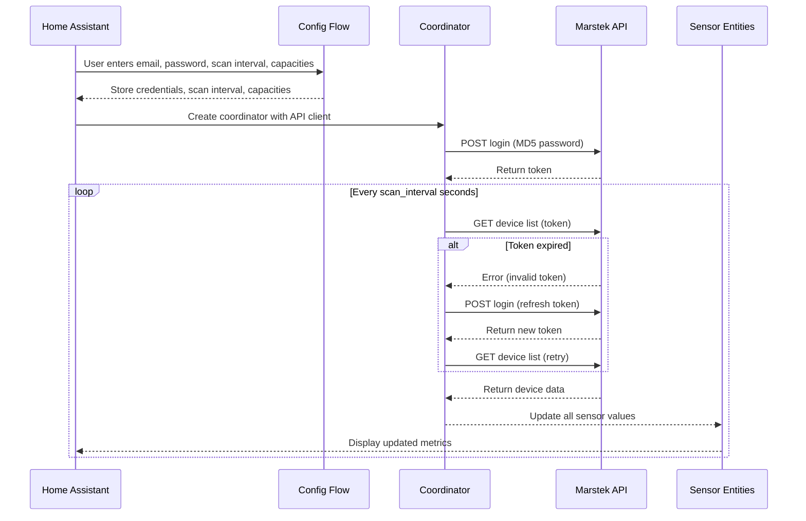

# Marstek Cloud Battery – Home Assistant Custom Integration

This custom integration connects your Marstek battery system (via the Marstek cloud API) to Home Assistant, pulling live data and exposing it as sensor entities.

---

## ✨ Features

- **Automatic login & token refresh**  
  Logs in to the Marstek cloud API using your credentials, hashes your password (MD5) before sending, and automatically refreshes the token if it expires.
  
- **Configurable scan interval**  
  Set how often the integration polls the API (10–3600 seconds) during initial setup or later via the Options menu.

- **Battery metrics exposed as sensors**  
  - `soc` – State of charge (%)
  - `charge` – Charge power (W)
  - `discharge` – Discharge power (W)
  - `load` – Load power (W)
  - `profit` – Profit (€)
  - `version` – Firmware version
  - `sn` – Serial number
  - `report_time` – Timestamp of last report
  - `total_charge` – Total charge per device (kWh).

- **Cross-device total charge sensor**  
  - `total_charge_all_devices` – Sum of total charges across all batteries (kWh).

- **Diagnostic sensors**  
  - `last_update` – Time of last successful update
  - `api_latency` – API call duration in milliseconds
  - `connection_status` – Online/offline status

- **Device registry integration**  
  Each battery appears as a device in HA with model, serial number, firmware version, and manufacturer.

- **Editable battery capacity**  
  Configure the default capacity (in kWh) for each battery during setup or later via the Options menu.

- **Smart device filtering**  
  Automatically filters out non-compatible or irrelevant device types (e.g., "HME-3") from the device list.

---

## 🛠 Installation

1. Copy the `marstek_cloud` folder into your Home Assistant `custom_components` directory.
2. Restart Home Assistant.
3. Go to **Settings → Devices & Services → Add Integration** and search for **Marstek Cloud Battery**.
4. Enter your Marstek cloud email, password, and desired scan interval.

---

## ⚙ Configuration

- **Scan interval** can be set during initial setup and changed later via the integration’s **Configure** option.
- **Default battery capacity** (in kWh) can be set for each battery during setup or via the **Options** menu.
- Default capacity is 5.12 kWh.
- Minimum scan interval is 10 seconds, maximum is 3600 seconds.

---

## 🔍 Logic Flow

Here’s how the integration works internally:

### 1. **Setup**
- `config_flow.py` collects your email, password, scan interval, and default battery capacities.
- These are stored securely in HA’s config entries.

### 2. **Coordinator & API**
- `__init__.py` creates:
  - An `aiohttp` session for async HTTP calls.
  - A `MarstekAPI` instance for talking to the cloud API.
  - A `MarstekCoordinator` (subclass of `DataUpdateCoordinator`) that schedules periodic updates.

### 3. **Login & Token Handling**
- On first run, `MarstekAPI._get_token()`:
  - MD5‑hashes your password.
  - Sends a POST request to `https://eu.hamedata.com/app/Solar/v2_get_device.php`.
  - Stores the returned `token`.
- On each update, `MarstekAPI.get_devices()`:
  - Calls `https://eu.hamedata.com/ems/api/v1/getDeviceList` with the token.
  - If the API responds with an invalid/expired token, it refreshes and retries once.
  - If the API responds with error code `8` (no access permission), it clears the cached token and logs the error. A new token will be obtained automatically on the next update cycle.

### 4. **Data Fetching**
- The coordinator's `_async_update_data()`:
  - Records the start time.
  - Calls `api.get_devices()` to fetch the latest battery list.
  - Filters out ignored device types (e.g., "HME-3").
  - Calculates API latency in milliseconds.
  - Returns the filtered list of devices to all entities.

### 5. **Entity Creation**
- `sensor.py`:  
  - For each device in the API response, creates:  
    - One `MarstekSensor` per metric in `SENSOR_TYPES`.  
    - One `MarstekDiagnosticSensor` per metric in `DIAGNOSTIC_SENSORS`.  
    - One `MarstekDeviceTotalChargeSensor` for the total charge per device.  
  - Creates a `MarstekTotalChargeSensor` for the cross-device total charge.  
  - Each entity has:  
    - A unique ID (`devid_fieldname`).  
    - Device info (name, model, serial, firmware, manufacturer).

### 6. **Updates**
- HA calls `async_update()` on entities when needed.
- Entities pull their latest value from the coordinator’s cached data.
- The coordinator refreshes data on the configured interval or when manually triggered.

---

## 📡 API Endpoints Used

- **Login**:  
  `POST https://eu.hamedata.com/app/Solar/v2_get_device.php?pwd=<MD5_PASSWORD>&mailbox=<EMAIL>`

- **Get Devices**:  
  `GET https://eu.hamedata.com/ems/api/v1/getDeviceList?token=<TOKEN>`

---

## 📊 Sequence Diagram

