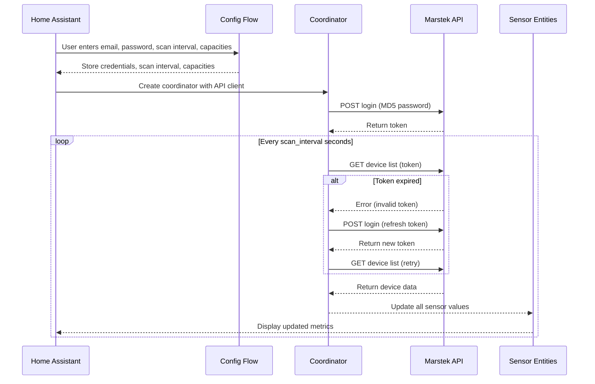

# Marstek Cloud Battery – Home Assistant Custom Integration

This custom integration connects your Marstek battery system (via the Marstek cloud API) to Home Assistant, pulling live data and exposing it as sensor entities.

---

## ✨ Features

- **Automatic login & token refresh**
  Logs in to the Marstek cloud API using your credentials, hashes your password (MD5) before sending, and automatically refreshes the token if it expires.

- **Re-authentication flow**
  When credentials expire, Home Assistant automatically prompts you to re-enter them without needing to delete and re-add the integration.

- **Options flow with auto-reload**
  Change scan interval and battery capacities through the Options menu. The integration automatically reloads when you save changes.

- **Robust error handling**
  Gracefully handles API errors, network issues, and timeouts with intelligent retry logic and clear error messages.

- **Battery metrics exposed as sensors**
  - `soc` – State of charge (%) with Battery device class
  - `charge` – Charge power (W) with Power device class
  - `discharge` – Discharge power (W) with Power device class
  - `load` – Load power (W) with Power device class
  - `pv` – Solar power (W) with Power device class
  - `grid` – Grid power (W) with Power device class
  - `profit` – Profit (€) with Monetary device class
  - `version` – Firmware version
  - `sn` – Serial number
  - `report_time` – Timestamp of last report with Timestamp device class
  - `total_charge` – Total stored energy per device (kWh) with Energy device class

- **Calculated power sensors**
  - `calculated_charge_power` – Calculated charge power (pv - discharge) for accurate charge tracking
  - `calculated_discharge_power` – Calculated discharge power (discharge - pv) for accurate discharge tracking

- **Cross-device total sensors**
  - `total_charge_all_devices` – Sum of total stored energy across all batteries (kWh)
  - `total_power_all_devices` – Total power (charge - discharge) across all devices (W)

- **Diagnostic sensors**
  - `last_update` – Time of last successful update with Timestamp device class
  - `api_latency` – API call duration with Duration device class
  - `connection_status` – Online/offline status

- **Device registry integration**
  Each battery appears as a device in HA with model, serial number, firmware version, and manufacturer.

- **Smart device filtering**
  Automatically filters out non-compatible or irrelevant device types (e.g., "HME-3") from the device list.

---

## 🛠 Installation

### Via HACS (Recommended)

1. Open HACS in Home Assistant
2. Click the three dots menu → **Custom repositories**
3. Add `https://github.com/thomasgriebner/marstek_cloud` as an Integration
4. Click **+ Explore & Download Repositories** and search for **Marstek Cloud**
5. Download the integration
6. Restart Home Assistant
7. Go to **Settings → Devices & Services → Add Integration** and search for **Marstek Cloud Battery**

### Manual Installation

1. Copy the `marstek_cloud` folder into your Home Assistant `custom_components` directory
2. Restart Home Assistant
3. Go to **Settings → Devices & Services → Add Integration** and search for **Marstek Cloud Battery**

---

## ⚙ Configuration

### Initial Setup
1. Go to **Settings → Devices & Services → Add Integration** and search for **Marstek Cloud**
2. Enter your Marstek Cloud credentials (email and password)
3. Configure scan interval (10-3600 seconds, default: 60 seconds)
4. Set default battery capacity (default: 5.12 kWh)
5. Click **Submit** - credentials are validated before saving

### Options Menu
Access via **Settings → Devices & Services → Marstek Cloud → Configure**:
- **Scan interval** – Change how often data is fetched from the API
- **Battery capacities** – Adjust capacity for each discovered battery
- Changes take effect immediately with automatic integration reload

### Re-authentication
If your credentials expire or change:
1. Home Assistant will display a notification
2. Click **Authenticate** in the notification or go to the integration settings
3. Enter your new credentials
4. Integration continues working without losing entity IDs or automations

---

## 🔍 Logic Flow

Here’s how the integration works internally:

### 1. **Setup**
- `config_flow.py` collects your email, password, scan interval, and default battery capacities.
- These are stored securely in HA’s config entries.

### 2. **Coordinator & API**
- `__init__.py` creates:
  - An `aiohttp` session for async HTTP calls.
  - A `MarstekAPI` instance for talking to the cloud API.
  - A `MarstekCoordinator` (subclass of `DataUpdateCoordinator`) that schedules periodic updates.

### 3. **Login & Token Handling**
- On first run, `MarstekAPI._get_token()`:
  - MD5‑hashes your password.
  - Sends a POST request to `https://eu.hamedata.com/app/Solar/v2_get_device.php`.
  - Stores the returned `token`.
- On each update, `MarstekAPI.get_devices()`:
  - Calls `https://eu.hamedata.com/ems/api/v1/getDeviceList` with the token.
  - If the API responds with an invalid/expired token, it refreshes and retries once.
  - If the API responds with error code `8` (no access permission), it clears the cached token and logs the error. A new token will be obtained automatically on the next update cycle.

### 4. **Data Fetching**
- The coordinator's `_async_update_data()`:
  - Records the start time.
  - Calls `api.get_devices()` to fetch the latest battery list.
  - Filters out ignored device types (e.g., "HME-3").
  - Calculates API latency in milliseconds.
  - Returns the filtered list of devices to all entities.

### 5. **Entity Creation**
- `sensor.py`:  
  - For each device in the API response, creates:  
    - One `MarstekSensor` per metric in `SENSOR_TYPES`.  
    - One `MarstekDiagnosticSensor` per metric in `DIAGNOSTIC_SENSORS`.  
    - One `MarstekDeviceTotalChargeSensor` for the total charge per device.  
  - Creates a `MarstekTotalChargeSensor` for the cross-device total charge.  
  - Each entity has:  
    - A unique ID (`devid_fieldname`).  
    - Device info (name, model, serial, firmware, manufacturer).

### 6. **Updates**
- HA calls `async_update()` on entities when needed.
- Entities pull their latest value from the coordinator’s cached data.
- The coordinator refreshes data on the configured interval or when manually triggered.

---

## 📡 API Endpoints Used

- **Login**:  
  `POST https://eu.hamedata.com/app/Solar/v2_get_device.php?pwd=<MD5_PASSWORD>&mailbox=<EMAIL>`

- **Get Devices**:  
  `GET https://eu.hamedata.com/ems/api/v1/getDeviceList?token=<TOKEN>`

---

## 📊 Sequence Diagram



---

## 🐛 Troubleshooting

### Integration setup fails with "invalid_auth"
- **Cause**: Incorrect email or password
- **Solution**: Double-check your Marstek Cloud credentials and try again

### Integration setup fails with "cannot_connect"
- **Cause**: Network issue or Marstek API temporarily unavailable
- **Solution**: Check your internet connection and try again in a few minutes

### Sensors show "unavailable"
- **Cause**: API connection issues or integration not loaded properly
- **Solution**:
  1. Check Home Assistant logs: **Settings → System → Logs**
  2. Look for warnings or errors from `marstek_cloud`
  3. Try reloading the integration: **Settings → Devices & Services → Marstek Cloud → ... → Reload**

### "No devices found" error
- **Cause**: Your Marstek Cloud account has no compatible devices registered
- **Solution**: Ensure at least one battery is registered in your Marstek Cloud account

### Authentication notifications keep appearing
- **Cause**: Invalid credentials or API token issues
- **Solution**:
  1. Click **Authenticate** in the notification
  2. Enter correct credentials
  3. If issue persists, remove and re-add the integration

### Enable debug logging
To see detailed logs for troubleshooting:
1. Add to `configuration.yaml`:
```yaml
logger:
  default: info
  logs:
    custom_components.marstek_cloud: debug
```
2. Restart Home Assistant
3. Check logs: **Settings → System → Logs**

---

## 📝 Changelog

### Version 0.4.0
- ✨ Added re-authentication flow for expired credentials
- ✨ Added options flow with auto-reload for scan interval and capacity changes
- ✨ Improved sensor device classes (TIMESTAMP, DURATION) for better Home Assistant integration
- ✨ Changed energy sensor state class from MEASUREMENT to TOTAL for proper statistics
- 🐛 Fixed error handling for API timeouts and network issues
- 🐛 Fixed entity creation logic (removed broken duplicate checking)
- 🐛 Improved logging with intelligent log levels (ERROR vs WARNING)
- 📚 Added German and English translations for all flows
- 🔧 Improved CI/CD with Python version matrix testing (3.11, 3.12)

### Version 0.3.0
- Initial HACS release

---

## 🤝 Contributing

Contributions are welcome! Please feel free to submit issues or pull requests.

---

## 📄 License

This project is provided as-is for personal use.
